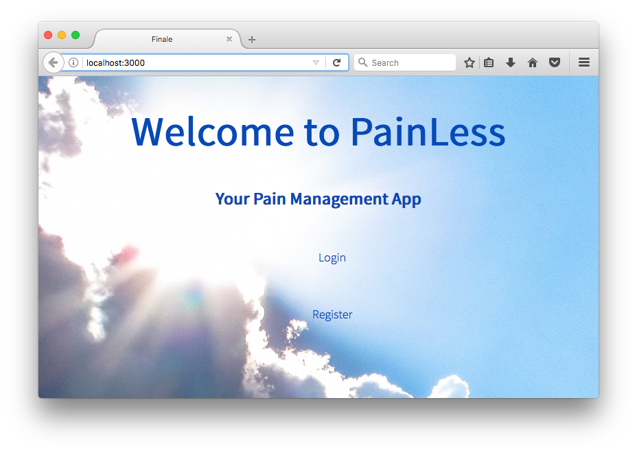
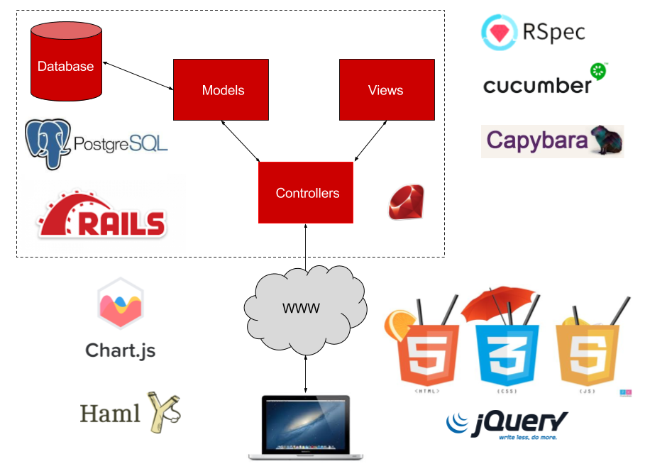
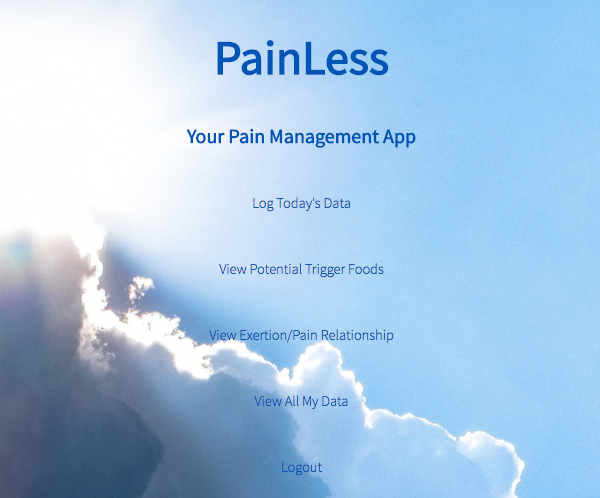
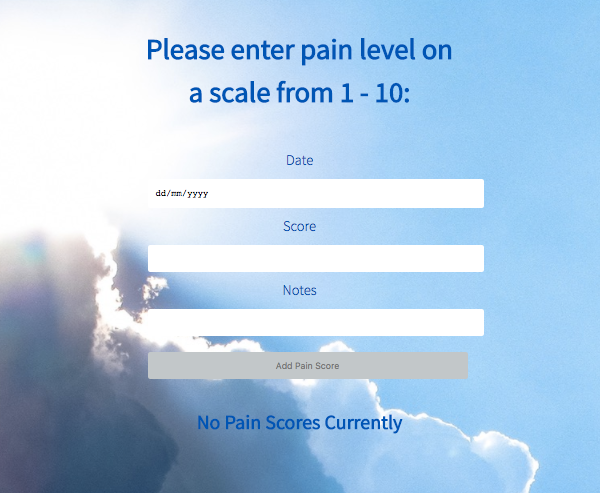
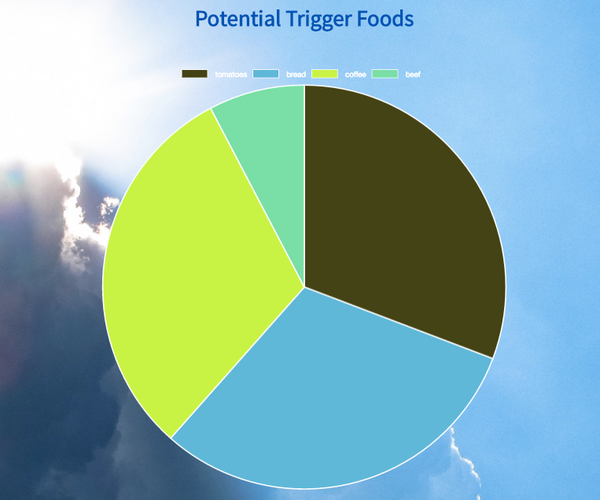
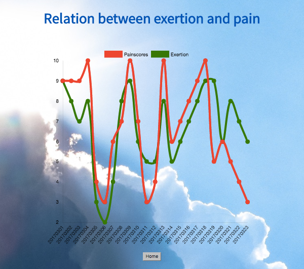

# PainLess - The Pain Management Web App
[](https://coveralls.io/github/shezdev/painLess?branch=master)

### A #Techforgood app that tracks dietary and physical environmental factors and returns data correlated with levels of pain inputted by the user.

**Built by [Shereen Finney](https://github.com/shezdev), [Samir Gossain](https://github.com/sim-ware), [Jack Henderson](https://github.com/artfulgarfunk) and [Konrad Schlatte](https://github.com/schlattk) in 8 days as the final project for Makers Academy.**


## Motivation
The purpose of this is to allow those who suffer with chronic conditions such as Arthritis and IBS to track their daily pain levels alongside environmental factors such as food and physical activities. This allows them to identify possible triggers for sudden flare ups - e.g. certain foods that may exacerbate their symptoms. In addition, users can access a log of all their inputs which can be exported to PDF, this can be shown to their GP to give a broad overview of their lifestyle and correlated pain.

## Getting started

- `git clone https://github.com/shezdev/painLess.git`
- `cd /painLess`
- `gem install rails`
- `brew install postgresql` (extra configuration may be needed to install the database user on your computer)
- `bundle install` in the root directory
- `bin/rake db:create` to create the databases:'painless_development' and 'painless_test'
- `bin/rake db:migrate` to run the database migrations


## Usage
- Run `bin/rails server` to run the Puma web server
- Visit `http://localhost:3000` to view the app in your browser
- Click on Register and follow the wizard

## Running tests
- Run `rspec` from the `/painLess` directory
- Currently shows `26 examples, 0 failures`

## Technology Stack
* Built using **[Ruby on Rails](http://rubyonrails.org/)**
* Uses a **[Puma Web Server](http://puma.io/)**
* Runs off a **[Postgres Database](https://www.postgresql.org/)**
* Tested using **[RSpec](http://rspec.info/)**, **[Capybara](http://teamcapybara.github.io/capybara/)** and **[Cucumber](https://cucumber.io/)**
* Test coverage statistics calculated using **[Coveralls](https://coveralls.io/)** and **[Travis CI](https://travis-ci.org/shezdev/painLess)**
* Front-end design uses **JavaScript** and **CSS**
* Trigger food pie chart and exert to pain line graph created using **[Chart.js](http://www.chartjs.org/)**
* PDF functionality to view all activity created using **[Wicked PDF](https://github.com/mileszs/wicked_pdf)**

***Architecture***



## Objectives of the Final Project

* Are you having fun? **YES**
* Are you a better developer than you were yesterday? **YES**
* **Can you use high-quality processes to build an extended project in a team?** **YES**

## Project Planning
Here is a synopsis of our first day group planning session:

* Check in with how everyone is, what they want to get out of the project at the end (demonstration of best practices and great teamwork), to make sure everyone is happy on the project going forward, that we all have an equal voice, listen to each other and are open to feedback.
* Brainstorming success factors for our project and how we want to work e.g. Prioritising TDD, pairing, switching pairs frequently, importance of planning and thinking of architecture, stand-ups and retros, lessons learnt from peers and previous projects.
* Trying to get everyone on the same page of understanding of the project idea, by first describing it almost in terms of what the user wants and needs, then drawing out how it could work (diagramming) and what the user might see (wireframes).
* Working on a one line description for this project.
* Deciding on the MVP functionality by answering from the user's perspective and thinking what is the smallest thing we could do.
* Writing user stories for the MVP.
* Brainstorming how we could extend the functionality, then coming up with user stories for v2 and a list for v3.
* Documenting this in a shared collaborative Google doc.
* Creating a table with basic fields such as front end, business logic, backend, testing framework - then researching technologies that could be used for each together, and their pros and cons.
* Considerations of any technology restrictions on our v3 idea list.
* Planning and estimating activities and hours needed to reach MVP (16).
* Working out how we can split the project for MVP into chunks that don't rely on each other and that could be merged later.
* Assigning pairs to those chunks randomly for the next day, swapping tasks at lunchtime.
* Ensuring we have daily stand ups (number out of 10)and retros to check in with everyone on the the day went.  For XP values!!
* Research question for everyone - how can we use Cucumber for test driven development?


## User Stories
As a group, we developed the following user stories that defined our goals for the project as well as what we considered to be the minimum viable product (MVP):

***MVP***
```
As a user
So that I can monitor my health
I want to be able to input what I’ve ate today and my pain

As a user
So I can see my data
I want to be able to see yesterday’s input
```
***V2 User stories***

```
As a user
So that I can see the patterns in my pain
I want to see what I ate the previous day, for the highest pain score.

As a user
So that I can input more information / see more patterns / more environmental factors
I want to input my activity/exertion (low/med/high)

As a user
So that I can see clearer patterns in my pain
I want to return group of foods causing high pain scores.
```
***V3 Functionality***
- Update food and painscores to show on same page as form
- Today's food and painscores are only displayed
- Functionality for multiple users (login etc)
- Update and delete functionality
- Can only add 1 Pain Score Per Day

***V4 Functionality***
- Data Visualisation of all Data
- Stats for GP/Dietician
- AJAX to recall previous entries

### Further Screenshots

***Homepage***


***Log today's pain data***


***View trigger foods***


***View exertion to pain relationship***

